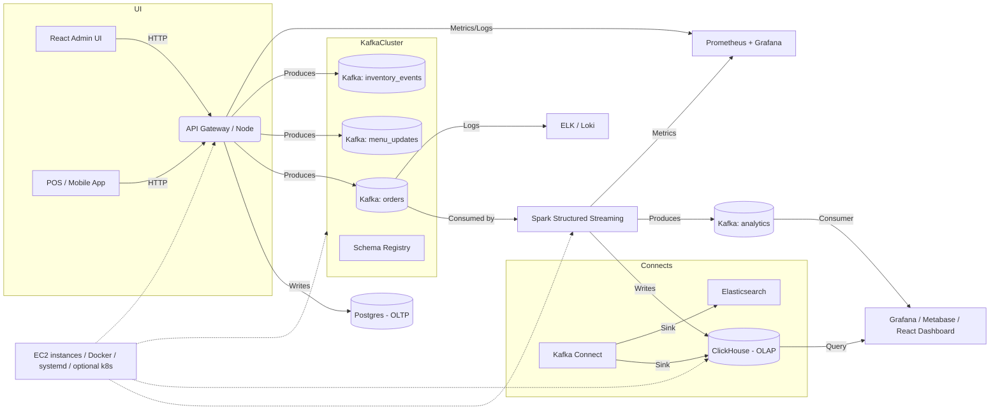

# Streaming-Drink-Shop
Private project for my small business

Draw.io https://app.diagrams.net/#G1LT6wFPNcbwo9tsGbsfNv926DRGZFh908#%7B%22pageId%22%3A%22lS7qHDq6ZlOi1aumd8E3%22%7D

# Kiến trúc hệ thống **Streaming Drink Shop** (chi tiết + kế hoạch luyện tập)

> Mục tiêu: xây dựng một hệ thống quản lý bán đồ uống đơn giản nhưng giàu tính học tập cho Data Engineer — có GUI để thêm/mở món, thu nhận event đặt hàng/stock theo streaming qua Kafka, xử lý real-time bằng Spark, lưu trữ cho OLTP (Postgres) và OLAP (ClickHouse/Materialized views), deployment lên EC2, monitoring, và nhiều bài tập thực hành.

---

## 1. Tổng quan luồng dữ liệu (tóm tắt)

1. Người dùng / nhân viên thao tác trên **Web UI (React)** hoặc **Admin UI** (thêm món, cập nhật giá, thay đổi trạng thái).
2. Backend API (Node.js / .NET) nhận request thay đổi menu hoặc tạo order -> ghi vào **Postgres** (transactional) và **publish event** lên **Kafka** (topic: `menu_updates`, `orders`, `inventory_events`).
3. Kafka giữ các event, có **Schema Registry** để quản schema (Avro/JSON Schema).
4. **Spark Structured Streaming** (PySpark/Scala) tiêu thụ topic `orders` để:

   * enrich order bằng data tĩnh (join với `menu` từ Postgres or cached copy),
   * tính toán aggregation real-time (sales per minute, top items, conversion rate),
   * xử lý late data với watermark,
   * viết kết quả vào **ClickHouse** (fast OLAP) / hoặc Kafka topic `analytics`.
5. **Kafka Connect**/sinks để đẩy event lịch sử vào ClickHouse / Elasticsearch / S3 nếu cần.
6. **Dashboard (Grafana / Metabase / React Dashboard)** đọc từ ClickHouse (hoặc Redis/Materialized view) để hiển thị realtime.
7. Monitoring: Prometheus + Grafana, log aggregation bằng ELK hoặc Loki.

---

## 2. Sơ đồ kiến trúc (Mermaid)



---

## 3. Thành phần chi tiết & gợi ý công nghệ

* **Frontend Admin / POS**: React + Ant Design (vì bạn đang quen với Ant Design), build as SPA, deployed trên Nginx.
* **Backend API**: Node.js (Express) hoặc .NET Core (nếu bạn muốn tiếp tục .NET). API chịu trách nhiệm transactions và publish events to Kafka.
* **Message broker**: Apache Kafka chạy trên EC2 (cluster nhỏ 3 node). Dùng KRaft mode để tránh Zookeeper nếu bạn muốn phiên bản mới, hoặc truyền thống có ZooKeeper.
* **Schema Registry**: Confluent Schema Registry (quản schema Avro/JSON Schema). Giúp schema evolution.
* **Stream processing**: Spark Structured Streaming (PySpark hoặc Scala). Thực hiện windowed aggregations, joins, exactly-once output (to sinks supporting idempotence).
* **OLTP DB**: PostgreSQL (EC2 hoặc RDS). Lưu menu, users, orders transactional.
* **OLAP / Analytics**: ClickHouse hoặc Druid cho dashboard real-time. Nếu muốn đơn giản có thể dùng materialized view trên Postgres + Redis cache nhưng hiệu năng kém hơn.
* **Kafka Connect**: để sink data vào ClickHouse/Postgres/S3.
* **Monitoring & Logging**: Prometheus + Grafana, và Loki/ElasticSearch + Kibana.
* **Caching**: Redis cho inventory quick-check, session.
* **Deployment**: Docker Compose cho dev; cho prod deploy trên EC2 instances (Docker + systemd) hoặc k3s/k8s nhỏ.

---

## 4. Thiết kế topic & schema (gợi ý)

* `menu_updates` — event khi thêm/sửa/xóa món

  ```json
  {
    "menu_id":"uuid",
    "action":"create|update|delete",
    "name":"Trà sữa",
    "price":50000,
    "timestamp":"2025-11-03T...Z"
  }
  ```

* `orders` — mỗi khi có order

  ```json
  {
    "order_id":"uuid",
    "user_id":"...",
    "items":[{"menu_id":"...","qty":2,"price":40000}],
    "total":80000,
    "created_at":"2025-11-03T...Z"
  }
  ```

* `inventory_events` — stock changes

* `analytics` — enriched events or pre-aggregations

Gợi ý dùng Avro + Schema Registry để xử lý thay đổi schema an toàn.

---

## 5. Spark Structured Streaming: chức năng cần luyện

* Consume Kafka topic (`orders`) => parse Avro/JSON
* Join với `menu` (static) để enrich info (tên, category)
* Windowed aggregations: `groupBy(window(order_time, '1 minute'), menu_id).count()`
* Handle late data: `withWatermark("created_at", "2 minutes")`
* Exactly-once sink: write to ClickHouse via JDBC or write back to Kafka topic `analytics` với idempotent producer

**Ví dụ PySpark (tóm tắt)**

```python
from pyspark.sql import SparkSession
spark = SparkSession.builder.appName("orders-stream").getOrCreate()
orders = spark.readStream.format("kafka").option("subscribe","orders").load()
# parse, withWatermark, join static menu (broadcast), aggregation, writeStream to ClickHouse
```

---

## 6. Dashboard & KPI (what to show)

* Sales per minute / hour (time series)
* Top 10 items in last 5/60 minutes
* Conversion rate (orders / visits) if tracking visits
* Inventory alerts (below threshold)
* Revenue, avg order value, refund rate

---

## 7. Lộ trình luyện tập (task list — tăng dần độ khó)

1. **Local dev**: Docker Compose gồm Zookeeper (optional), Kafka, Schema Registry, Postgres, Redis, Connect, and a small Node API + React UI.
2. **Producer**: implement API that writes orders to Postgres and produces Kafka event.
3. **Consumer basic**: simple consumer (Python kafkajs) that reads orders and prints.
4. **Spark job**: write Structured Streaming job to compute `sales_per_minute` and write to console / file.
5. **Enrichment**: add static menu lookup — join in Spark.
6. **Exactly-once**: test idempotency & fault tolerance by restarting Spark and brokers.
7. **Deploy to EC2**: create one EC2 for backend+front, another for Kafka (or a 3-node Kafka cluster), another for Spark worker; use systemd + docker-compose or k3s.
8. **Monitoring**: add Prometheus + Grafana dashboards.
9. **Scale tests**: simulate load (k6) and measure latency and throughput.
10. **Advanced**: implement Kafka Connect sinks to ClickHouse and build real-time dashboard.

---

## 8. Cấu trúc deploy trên EC2 (gợi ý)

* **Instance A (t2.medium x3)**: Kafka brokers (3 nodes) — đảm bảo replication factor = 3, min.insync.replicas=2
* **Instance B**: Zookeeper / Schema Registry / Kafka Connect
* **Instance C**: Spark master + worker(s) (or EMR/Databricks nếu bạn muốn managed)
* **Instance D**: Backend + Frontend (Docker)
* **Instance E**: ClickHouse + Postgres

(hoặc gộp nhỏ gọn tuỳ budget — dev: 2 instances đủ)

---

## 9. Kiểm thử & lỗi thường gặp (và cách khắc phục)

* **Ordering duplicates**: dùng idempotent writes, dedupe bằng order_id.
* **Late events**: watermark + allowedLateness.
* **Schema change**: dùng Schema Registry và Avro with compatibility.
* **Broker full disk**: set log.retention.bytes and monitor disk.

---

## 10. Deliverables mình sẽ giúp bạn làm (nếu bạn muốn tiếp tục):

* Bản vẽ kiến trúc (PNG / SVG) từ sơ đồ trên.
* File `docker-compose.yml` mẫu cho dev (Kafka, Schema Registry, Postgres, Redis, Kafka Connect, ClickHouse).
* Template Node.js API (producer + DB write).
* Spark Structured Streaming job (PySpark) sample.
* Terraform script / bash scripts deploy cơ bản lên EC2.
* Grafana dashboard JSON mẫu.

---

Nếu bạn muốn, mình sẽ tiếp tục và **tạo** các file cụ thể (docker-compose, sample code, Spark job, hoặc xuất sơ đồ thành PNG). Chỉ nói tiếp bạn muốn phần nào trước — mình sẽ làm từng bước và gửi cho bạn.


